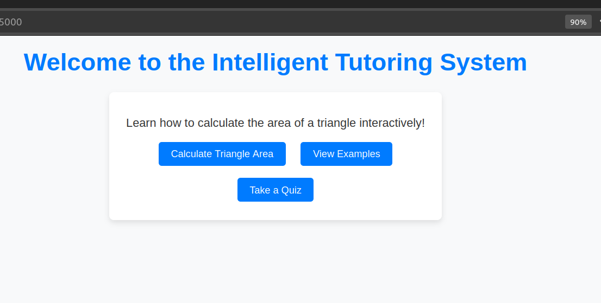
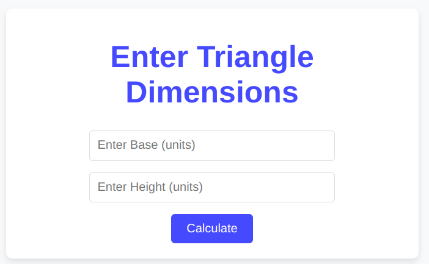
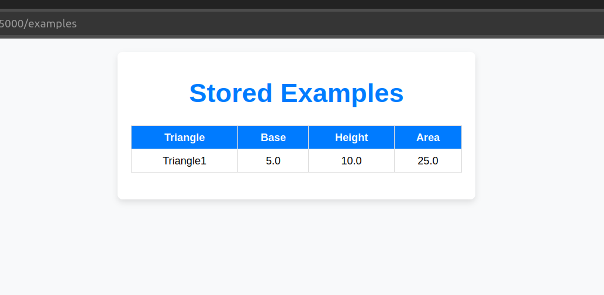
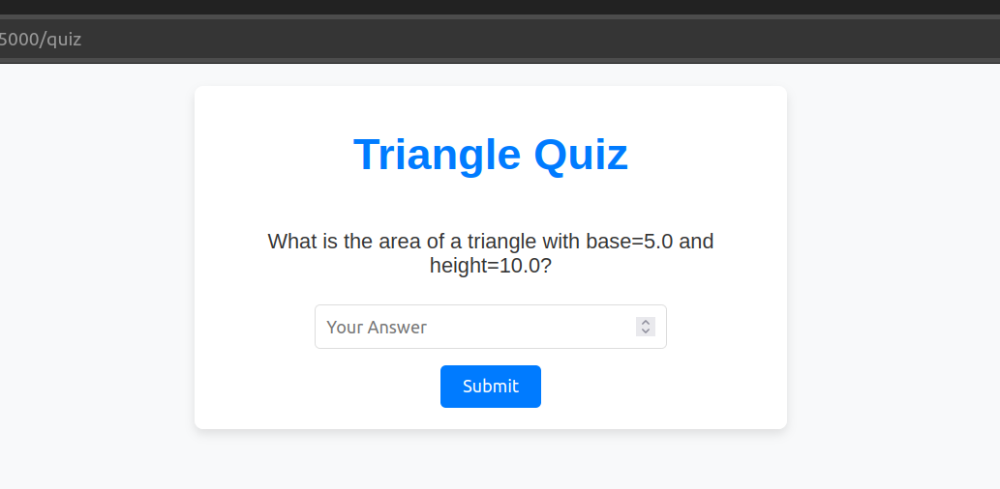

# Intelligent Tutoring System for Calculating the Area of a Triangle 

A web-based application built with Flask that helps users calculate and visualize triangle areas using RDF ontology.

## Features

- Calculate triangle area by inputting base and height
- View example triangles from RDF ontology
- Interactive quiz to test triangle area knowledge
- Visualize triangles with matplotlib
- RDF-based knowledge representation

## Technologies Used

- Python 3.x
- Flask
- RDFlib
- Matplotlib
- HTML/CSS
- RDF Ontology

## Installation

1.Clone the repository

##### Run  the following command ####

git clone https://github.com/madan03/triangle_its.git

cd triangle_its

2. Install required dependencies

#### Run in Terminal this commmand ###

pip install -r requirements.txt

3. Ensure you have the RDF ontology file (`triangle_area_ontology.rdf`) in the project root directory

4. Run the application

#### Type terminal bellow command ####

python app.py

5.Access the application in your web browser at http://localhost:5000

    
    
<i>Triangle ITS web interface showing the main home page</i>

    
    
<i>Example of triangle area calculation</i>

    
    
<i>Interactive stored example </i>

    
    
<i>Interactive quiz interface</i>

